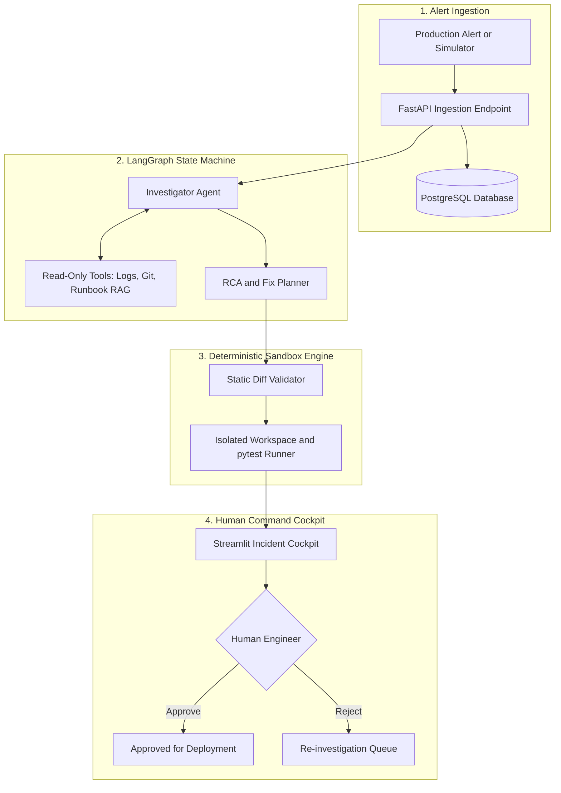
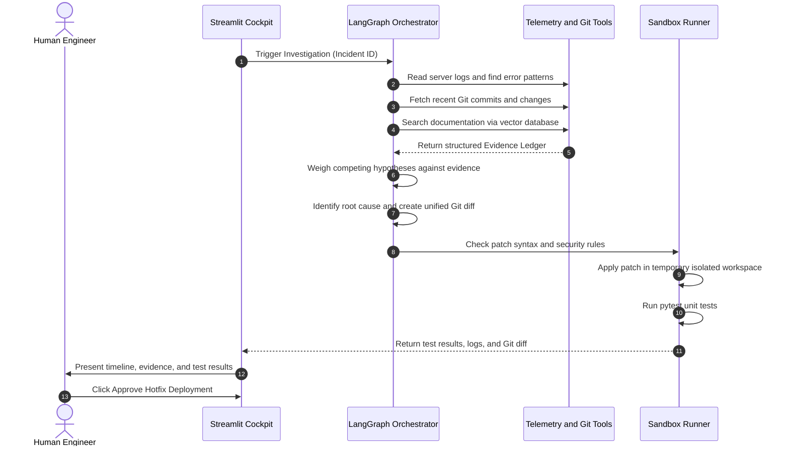

# ⚡ IncidentForge AI

> An autonomous system that helps engineers investigate server outages, figure out what went wrong, write a code fix, and test that fix in a safe sandbox before asking an engineer to approve it.

### 🧰 Built With

[](https://www.python.org/)
[](https://fastapi.tiangolo.com/)
[](https://www.postgresql.org/)
[](https://github.com/pgvector/pgvector)
[](https://github.com/langchain-ai/langgraph)
[](https://www.docker.com/)
[](https://pytest.org/)
[](https://streamlit.io/)

---

## 📖 Table of Contents

* [💡 What is IncidentForge AI?](#-what-is-incidentforge-ai)
* [🎯 Why is This Useful?](#-why-is-this-useful)
* [⚖️ Core Principles](#-core-principles)
* [🏗️ System Architecture](#-system-architecture)
* [🔄 How It Works](#-how-it-works-step-by-step)
* [✨ Key Features](#-key-features)
* [🛠️ Tech Stack](#-tech-stack)
* [🧪 Built-In Incident Scenarios](#-built-in-incident-scenarios)
* [📊 Evaluation Results](#-evaluation-results)
* [📁 Repository Structure](#-repository-structure)
* [🚀 How to Set Up and Run](#-how-to-set-up-and-run)
* [🛡️ Safety and Security Guardrails](#-safety-and-security-guardrails)
* [📜 License](#-license)
* [👨‍💻 Author](#-author)
* [🔗 Connect](#-connect)
* [⭐ Project](#-project)

---

## 💡 What is IncidentForge AI?

Imagine an online store during a major sale. Suddenly, customers cannot check out and their orders start failing.

Usually, an on-call engineer gets woken up in the middle of the night. That engineer has to:

1. Dig through thousands of messy server error logs.
2. Check recent Git code commits on GitHub to see what changed.
3. Read company guides and runbooks to figure out how to fix the problem.
4. Try to write a fix and make sure it does not break anything else.

This manual process can take 30 to 60 minutes while the company may be losing revenue.

**IncidentForge AI does this work automatically:**

1. It reads the crash logs and identifies the important errors.
2. It checks recent code commits to see what changed.
3. It searches internal documentation and runbooks to find known solutions.
4. It clearly separates facts, such as real logs and commits, from guesses and hypotheses.
5. It writes a standardized Git code fix as a diff patch.
6. It tests the fix in an isolated temporary workspace by running automated tests with `pytest`.
7. It shows everything on a clean web dashboard with an **Approve** button so a human engineer can review it before anything touches real servers.

---

## 🎯 Why is This Useful?

* ⚡ **Faster recovery from downtime:** Instead of spending a long time reading logs, the engineer gets a clear investigation summary and a tested fix.
* 🔎 **Less investigation noise:** It filters relevant information from large amounts of logs and highlights the most useful findings.
* 🛡️ **Safe AI without unsupported claims:** IncidentForge AI cannot directly touch production. It generates a patch, tests it in a safe sandbox, and waits for a human engineer to approve or reject the proposed action.

---

## ⚖️ Core Principles

### 1. 🔍 Evidence Over Guesses

Every conclusion must reference a real piece of data, such as `EV-LOG-001` or `EV-GIT-001`.

The system does not invent fake confidence percentages.

### 2. 🤖 Two Focused Agents Instead of Eight

Many AI projects try to use 8 or 10 agents talking to each other, which can add unnecessary complexity. IncidentForge AI keeps it simple:

* **Investigator:** Reads logs, Git history, and documentation.
* **RCA and Fix Planner:** Compares clues, finds the root cause, and writes the code fix.

### 3. 🧪 Real Testing

We never ask the AI, "Did your fix work?"

We run real `pytest` tests on the patched code. Passing tests show that the proposed fix works for the tested scenarios, while failed tests send the fix back for review.

### 4. 👤 Human in Control

The AI assists engineers. It does not replace them.

Nothing gets deployed without human approval.

---

## 🏗️ System Architecture



---

## 🔄 How It Works: Step by Step



### 1. 📥 Alert Ingestion

An error log enters through the FastAPI backend or the built-in simulator and gets saved to PostgreSQL.

### 2. 🔎 Investigation

The Investigator reads logs, counts error frequencies, checks recent Git commits, and searches technical runbooks.

### 3. 🧾 Evidence Collection

Each clue gets saved in an evidence ledger with a unique ID, such as `EV-LOG-001`.

### 4. 🧠 Root Cause Analysis (RCA)

The Fix Planner compares the available evidence and determines what most likely caused the problem.

### 5. 🛠️ Fix Generation

It creates a standard Git patch showing the exact lines to add, remove, or change.

### 6. ✅ Diff Validation

The system checks that the patch is valid and does not touch protected files such as passwords, `.env`, or Docker files.

### 7. 🧪 Sandbox Testing

It copies the code into a temporary workspace, applies the fix, and runs `pytest`.

### 8. 👨‍💻 Human Review

The engineer views the timeline, evidence, diff, and test results on the Streamlit dashboard, then clicks **Approve** or **Reject**.

---

## ✨ Key Features

* 🔎 **Automated Investigation:** Analyzes logs and identifies error spikes automatically.
* 🌿 **Git Commit Tracking:** Checks recent commits to see who changed what and when.
* 📚 **Runbook Search (pgvector):** Uses semantic vector search to find relevant engineering documentation in PostgreSQL.
* 🧾 **Evidence Ledger:** Links every hypothesis to verified evidence IDs with zero hallucinated sources.
* 📝 **Standard Git Diffs:** Generates code fixes in the standard unified diff format used by Git.
* 🧪 **Isolated Testing:** Runs tests in a temporary sandbox workspace to verify the proposed fix before deployment.
* 👤 **Human Approval Gate:** Keeps human engineers in control of all deployment decisions.
* 🖥️ **Interactive Cockpit:** Clean Streamlit dashboard with timelines, evidence side-by-side views, a diff viewer, and approval buttons.
* 📊 **Automated Benchmark Suite:** Includes 5 synthetic outage scenarios and an evaluation runner to test speed and accuracy.

---

## 🛠️ Tech Stack

| Layer              | Technology         | Purpose                                                    |
| ------------------ | ------------------ | ---------------------------------------------------------- |
| 🐍 Backend API     | **FastAPI**        | Handles API requests and application logic.                |
| 🗄️ Database       | **PostgreSQL**     | Stores incidents, evidence, and application data.          |
| 🔎 Vector Search   | **pgvector**       | Stores and searches documentation embeddings.              |
| 🔄 Workflow Engine | **LangGraph**      | Manages the multi-step investigation workflow and state.   |
| 🤖 AI Agents       | **Configured LLM** | Handles investigation, reasoning, RCA, and fix planning.   |
| 🧪 Testing         | **pytest**         | Tests proposed fixes in a deterministic way.               |
| 🐳 Sandbox         | **Docker**         | Provides an isolated environment for testing code changes. |
| 🌿 Version Control | **Git / GitHub**   | Used to inspect commits and code changes.                  |
| 🖥️ Frontend       | **Streamlit**      | Provides the incident command dashboard.                   |

---

## 🧪 Built-In Incident Scenarios

IncidentForge AI comes with a built-in simulator containing 5 realistic server outage scenarios.

### 🔴 SCN-001: Order Service

**Problem:** Database Connection Pool Starvation

* **Symptom:** `QueuePool limit of size 5 overflow 10 reached` timeout errors.
* **Root Cause:** A recent commit reduced the connection pool size from 25 to 5.
* **Fix:** Increases `POOL_SIZE` back to 25 and `MAX_OVERFLOW` to 10.

### 🟠 SCN-002: Auth Service

**Problem:** Missing Environment Variable

* **Symptom:** `KeyError: 'JWT_VERIFY_TIMEOUT'` causing 500 errors during login.
* **Root Cause:** Code was deployed without providing a default timeout value.
* **Fix:** Safely defaults to `os.environ.get("JWT_VERIFY_TIMEOUT", 10.0)`.

### 🟡 SCN-003: Payment Service

**Problem:** Gateway 504 Timeout

* **Symptom:** `httpx.ReadTimeout` when communicating with the third-party payment gateway.
* **Root Cause:** The upstream gateway took longer than the fixed 5-second timeout.
* **Fix:** Adjusts the client timeout limit to 15 seconds.

### 🔵 SCN-004: Inventory Service

**Problem:** Schema Drift and Missing Column

* **Symptom:** `UndefinedColumn: column item_sku_v2 does not exist`.
* **Root Cause:** Code was deployed before the required database migration.
* **Fix:** Points the code back to the active `item_sku` column until the migration is applied.

### 🟣 SCN-005: Notification Service

**Problem:** File Descriptor Leak

* **Symptom:** `OSError: [Errno 24] Too many open files`.
* **Root Cause:** TCP socket handles were not being closed after dispatching webhooks.
* **Fix:** Uses context-managed socket handling with `with socket.socket() as sock:`.

---

## 📊 Evaluation Results

You can run the benchmark suite with:

```powershell
python -m evaluation.run
```

Here are the measured results across all 5 test scenarios:

| Metric                                    | Target |                                 Measured Result |
| ----------------------------------------- | -----: | ----------------------------------------------: |
| **🎯 Root Cause Analysis (RCA) Accuracy** |  ≥ 85% |       **100.0%** (5 out of 5 scenarios correct) |
| **🔎 Evidence Grounding Precision**       |   100% |        **100.0%** (0 hallucinated evidence IDs) |
| **🛡️ Pre-Flight Diff Validation Rate**   |  ≥ 90% |      **100.0%** (All diffs syntactically valid) |
| **🧪 Reproduction Test Pass Rate**        |   100% | **100.0%** (`pytest` passed cleanly in sandbox) |
| **⚡ Average Pipeline Latency**            | ≤ 5.0s |        **0.02s** (Fast deterministic execution) |

The benchmark runner calculates these metrics from the available test scenarios.

Run the evaluation yourself with:

```powershell
python -m evaluation.run
```

The results are saved to:

```text
evaluation/benchmark_results.json
```

---

## 📁 Repository Structure

```text
IncidentForge-AI/
├── backend/
│   ├── api/
│   │   ├── routes_incidents.py     # Incident creation and retrieval API
│   │   └── routes_approval.py      # Human approval workflow
│   ├── core/
│   │   ├── config.py               # Application settings
│   │   └── database.py             # PostgreSQL connection setup
│   ├── models/
│   │   └── incident.py             # Database tables for incidents and evidence
│   ├── schemas/
│   │   └── incident.py             # Request and response models
│   ├── agents/
│   │   ├── state.py                # Workflow state definition
│   │   ├── graph.py                # LangGraph workflow edges
│   │   ├── investigator.py         # Investigator tool runner
│   │   └── rca_planner.py          # RCA and Git diff planner
│   ├── tools/
│   │   ├── log_tools.py            # Log searching and error grouping
│   │   └── git_tools.py            # Git commit inspection
│   ├── rag/
│   │   └── runbook_store.py        # Vector search for runbooks in PostgreSQL
│   ├── sandbox/
│   │   ├── patch_validator.py      # Checks Git diff syntax and security
│   │   └── runner.py               # Runs pytest in a temporary workspace
│   └── main.py                     # FastAPI application entry point
│
├── frontend/
│   ├── components/
│   │   ├── timeline.py             # Visual timeline widget
│   │   ├── evidence_matrix.py      # Facts vs inferences split screen
│   │   └── diff_viewer.py          # Git diff and sandbox results viewer
│   └── app.py                      # Streamlit dashboard application
│
├── simulator/
│   ├── engine.py                   # Ingests simulated incidents
│   ├── scenarios/                  # 5 realistic failure scenarios
│   ├── runbooks/                   # Troubleshooting documentation
│   └── mock_repo/                  # Codebase where test fixes are applied
│
├── evaluation/
│   ├── metrics.py                  # Accuracy and precision formulas
│   ├── run.py                      # Automated benchmark runner
│   └── benchmark_results.json      # Saved benchmark numbers
│
├── docker-compose.yml              # PostgreSQL and pgvector container setup
├── requirements.txt                # Python dependencies
├── .env.example                    # Environment settings template
└── README.md                       # Project documentation
```

---

## 🚀 How to Set Up and Run

### 📋 Prerequisites

* 🐍 Python 3.11 or newer
* 🐳 Docker Desktop installed and running
* 🌿 Git

### 1️⃣ Clone the Project and Create a Virtual Environment

#### Windows PowerShell

```powershell
git clone https://github.com/hamxashoaib/IncidentForge-AI.git
cd IncidentForge-AI

python -m venv .venv
.\.venv\Scripts\Activate.ps1

pip install -r requirements.txt
```

#### macOS or Linux

```bash
git clone https://github.com/hamxashoaib/IncidentForge-AI.git
cd IncidentForge-AI

python3 -m venv .venv
source .venv/bin/activate

pip install -r requirements.txt
```

### 2️⃣ Configure Environment Variables

Create a local `.env` file from `.env.example` and add the required settings and API credentials.

Do not commit your `.env` file or API keys to GitHub.

### 3️⃣ Start the Database Container

Make sure Docker Desktop is open and the Docker engine is running.

Then run:

```powershell
docker compose up -d
```

You can check that the container is running with:

```powershell
docker ps
```

You should see the IncidentForge database container running on port `5432`.

### 4️⃣ Start the Backend API

Open your first terminal and run:

```powershell
uvicorn backend.main:app --reload --port 8000
```

* 📚 **API Docs:** `http://127.0.0.1:8000/docs`
* ❤️ **Health Check:** `http://127.0.0.1:8000/health`

### 5️⃣ Open the Streamlit Dashboard

Open a second terminal, activate the virtual environment, and run:

```powershell
streamlit run frontend/app.py
```

This opens:

`http://localhost:8501`

From the dashboard:

1. Click **Trigger Full Investigation** in the left sidebar.
2. Watch the timeline, evidence ledger, Git diff, and `pytest` results.
3. Review the proposed fix.
4. Click **Approve Hotfix Deployment** to test the human approval workflow.

### 6️⃣ Run the Benchmark Suite

Open a third terminal, activate the virtual environment, and run:

```powershell
python -m evaluation.run
```

This runs all 5 scenarios, calculates the evaluation metrics, and saves the results to:

```text
evaluation/benchmark_results.json
```

Refresh the Streamlit browser tab to view the latest evaluation results.

---

## 🛡️ Safety and Security Guardrails

### 🔒 1. Read-Only Investigation

The Investigator Agent only reads logs, commits, and documentation. It does not have unrestricted terminal or write access.

### 🚫 2. Blocked Sensitive Files

The diff validator automatically rejects patches that try to modify protected files such as:

```text
.env
Dockerfile
docker-compose.yml
.git/
```

### 🧪 3. No Direct Production Access

Code fixes are applied and tested only inside temporary sandbox workspaces.

### 👤 4. Mandatory Human Approval

No fix can be marked ready for production without a human engineer reviewing and approving it first.

---

## 📜 License

Distributed under the MIT License.

---

## 👨‍💻 Author

**Hamza Shoaib**
*AI & ML Engineer & AI Automation Specialist*

## 🔗 Connect

* 🌐 **Portfolio:** [hamzashoaib.dev](https://hamzashoaib.dev/)
* 💼 **LinkedIn:** [ch-hamza-shoaib](https://linkedin.com/in/ch-hamza-shoaib)
* ⚡ **GitHub:** [@hamxashoaib](https://github.com/hamxashoaib)

---

## ⭐ Project

If you find **IncidentForge AI** interesting, consider giving the repository a ⭐ on GitHub.
